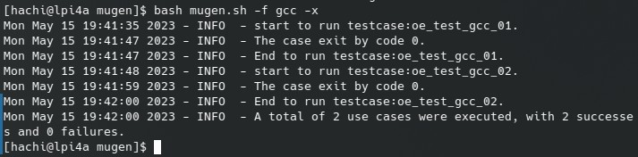

# GCC 测试套

## 测试用例

| 测试套 | 用例名  | 测试级别 | 测试类型 | 用例描述 | 节点数 | 预置条件 | 操作步骤                                                                                                                                                                                                                                                                                                                                                                                                                                                                                                                                                                                                                                                                                                                                                                                                                                                                                                                                                                                                                                                                                                                                                                                                                                                                                                                                                                                                                                                                                                                                                                                                                                                                                                                                                                                                                                                                                                                                                                                                                                                                                                                                                                                                                                                                                                                                                                                                                                                                                                                                                                                                                                                                                                                                                                                                                                             | 预期结果 | 是否自动化 | 备注 |
|:-----:|:------:|:-----:|:------:|:------:|:-------:|:------:| :---: |:---:|:------:|:---:|
| gcc |oe_test_gcc_01 |单元测试|功能测试|测试 gcc 基本参数    |1|安装 gcc 二进制包：dnf install -y gcc | 1、-v。输出基本信息。执行命令： gcc -v 2>&1 \| grep -Pz "gcc version $(rpm -q gcc --queryformat '%{version}') \(GCC\)"  2、--help 。输出帮助信息。执行命令： gcc --help \| grep -Pz "Usage: gcc \[options\] file..." | 1. 输出基本信息  2. 输出帮助信息| 是     | |
| gcc |oe_test_gcc_02 |单元测试|功能测试|测试 gcc 基本功能    |1|1. 安装 gcc 二进制包：dnf install -y gcc  2. 测试目录存在 hello world 测试程序 test.c | 1. -S 仅编译。执行命令： gcc -S test.c -o test.S   2. 编译生成二进制。执行命令 gcc test.S -o test.o   3. 编译生成的二进制能够打印预期结果。执行命令： ./test.o \|grep -Pz '^hello, world$' | 1. 编译生成汇编文件 test.S  2. 汇编链接得到二进制 test.o 3. 二进制运行打印 hello, world | 是     | |

## 测试结果

