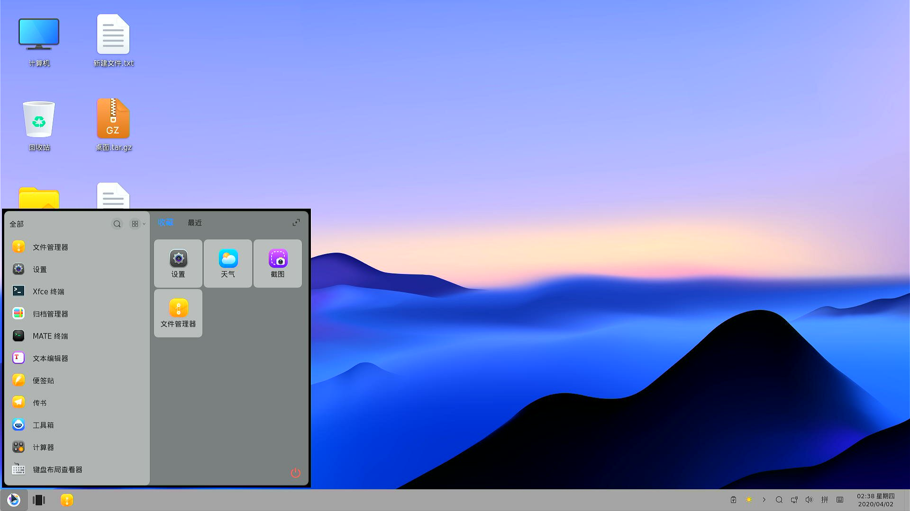
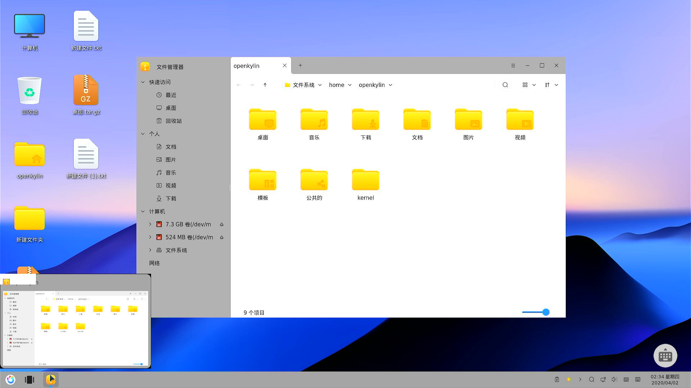
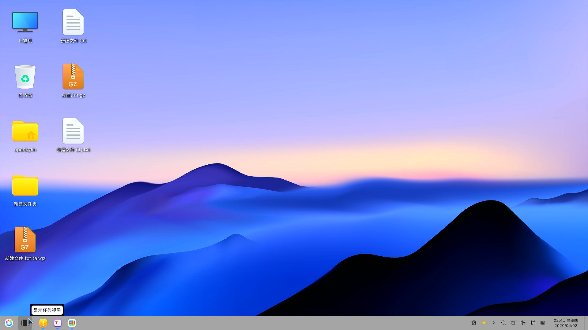
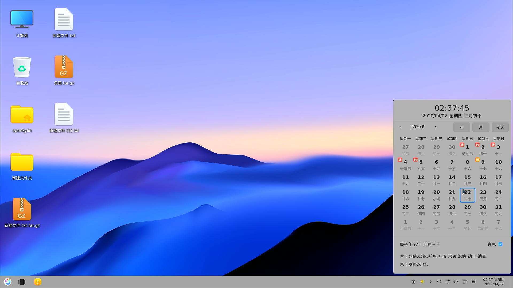
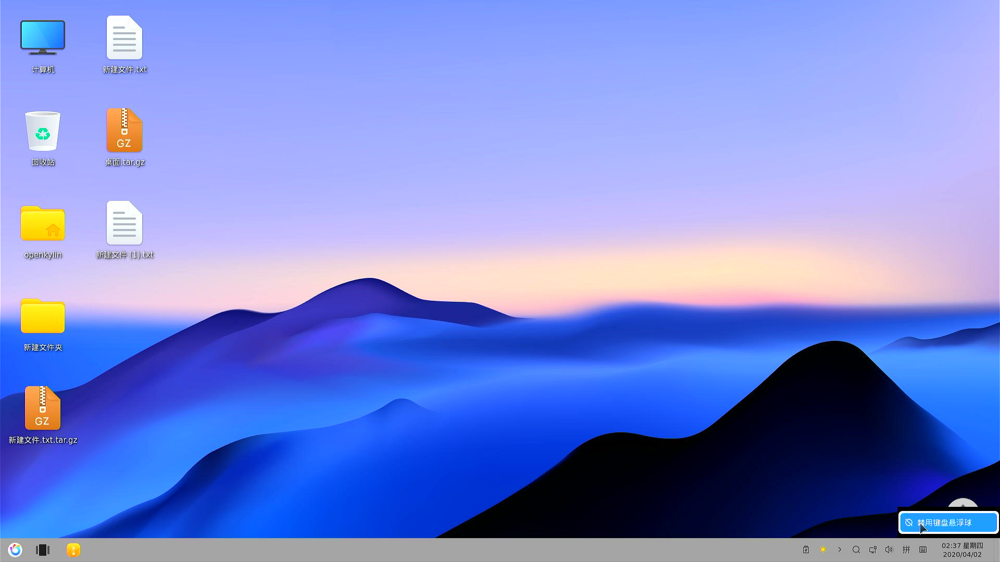
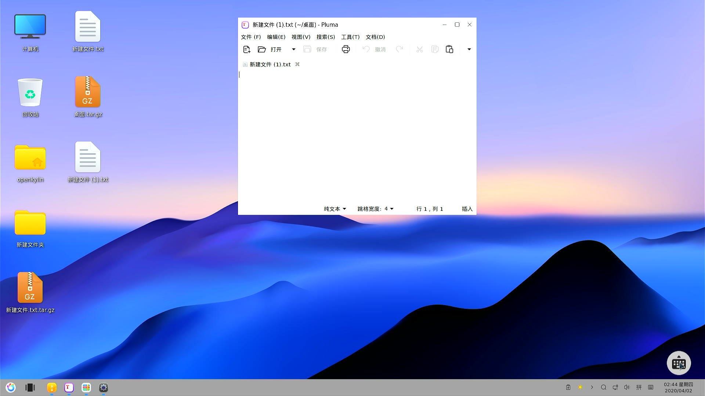
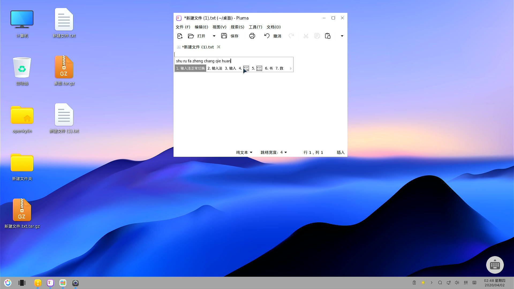
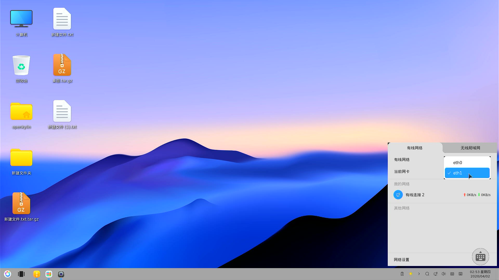
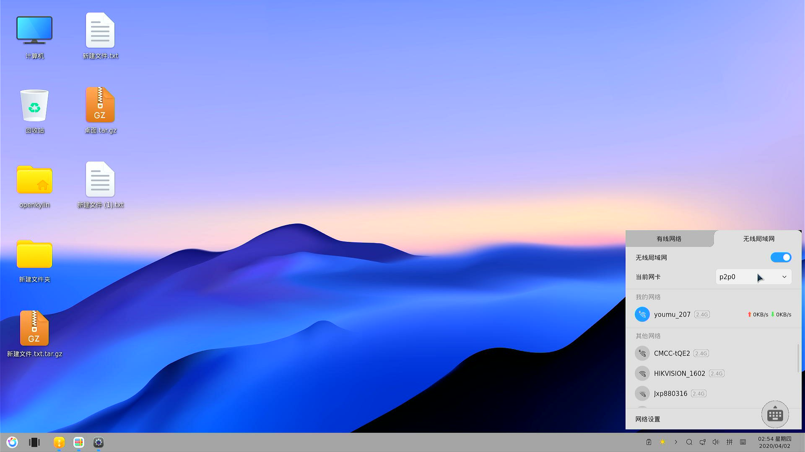
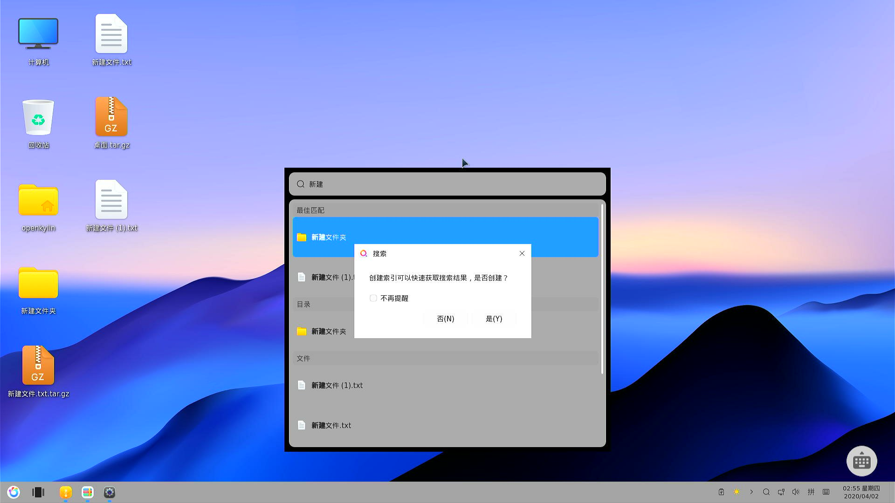

# 桌面 dock 功能

## 操作步骤

1. 单击开始按钮调出开始菜单，右键开始按钮调出用户操作
2. 打开文件管理器，将鼠标指针悬浮在 dock 上的缩略图标上，查看窗口缩略图
3. 右键文件管理器缩略图标，进行固定和取消固定
4. 点击任务视图，查看任务视图
5. 点击日历，调出日历进行操作
6. 右键虚拟键盘按钮，启用/禁用悬浮球
7. 在输入状态，点击悬浮球调出虚拟键盘
8. 右键输入法图标选择输入法，在输入状态切换中英文
9. 单击/右键音量图标，进行音量调整
10. 单击网络图标，进行网络调整
11. 单击搜索图标，进行文件搜索
12. 打开天气，测试系统托盘展开收起，右键操作

## 预期结果

能够正常使用开始菜单

能够正常显示窗口缩略图

能够正常固定和取消固定

能够正常显示任务视图

能够正常操作日历

能够正常使用虚拟键盘和控制悬浮球

能够正常切换和使用输入法

能够正常进行音量调整

能够正常进行网络调整

能够正常进行搜索

系统托盘正常使用

## 测试结果

查看窗口缩略图偶尔会导致 dock 重启

任务视图功能没有反应

在输入状态无法调出虚拟键盘

