# Pinpong Milkv Duo Setup Manual

环境信息

+ OS: Ubuntu 20.04 LTS x86_64
+ Kernel: 6.1.45-1-lts

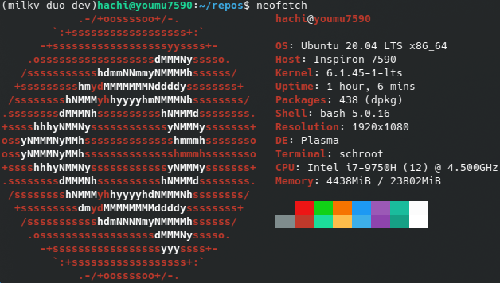

## 搭建开发环境

### 安装所需的软件包

```bash
apt-get install pkg-config build-essential ninja-build automake autoconf libtool wget curl git gcc libssl-dev bc slib squashfs-tools android-sdk-libsparse-utils jq python3-distutils scons parallel tree python3-dev python3-pip device-tree-compiler ssh cpio fakeroot libncurses5 flex bison libncurses5-dev genext2fs rsync unzip dosfstools mtools tclsh ssh-client android-sdk-ext4-utils
```

### 安装 cmake

由于 Ubuntu 20.04 LTS 软件源中的 cmake 版本低于编译 sdk 所需的 3.16.5 ，故需要编译安装 cmake

```bash
mkdir cmake && cd cmake
wget https://github.com/Kitware/CMake/releases/download/v3.26.4/cmake-3.26.4-linux-x86_64.sh
chmod +x cmake-3.26.4-linux-x86_64.sh
sh cmake-3.26.4-linux-x86_64.sh --skip-license --prefix=/usr/local/
cmake --version
```

版本输出应为 ``cmake version 3.26.4``

## 构建带 python 支持的镜像

由于 pinpong 依赖 python 环境，故这里构建具有 python 支持的镜像

克隆仓库

```bash
git clone https://github.com/milkv-duo/duo-buildroot-sdk.git duo-buildroot-sdk-python
cd duo-buildroot-sdk-python
```

使用 ``menuconfig`` 添加的选项会被脚本覆盖，直接向 cvitek_cv1800b_milkv_duo_sd_defconfig 添加所需编译选项发现也没有生效

此处参考[这篇博客](https://community.milkv.io/t/milkv-duo-linux-htop-python3-7-64/236)

```bash
vim buildroot-2021.05/configs/milkv_duo_musl_riscv64_defconfig

# 添加在最后
# for python3
BR2_PACKAGE_PYTHON3=y
```

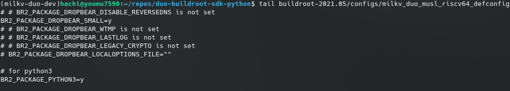

一键编译

```bash
export PATH=/usr/sbin/:$PATH
./build_milkv.sh
```

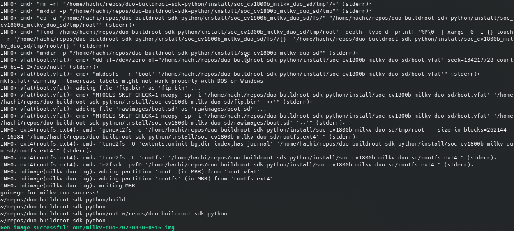

若没有更正 ``PATH`` 环境变量，在非 root 的普通用户下，可能出现以下错误导致镜像生成失败

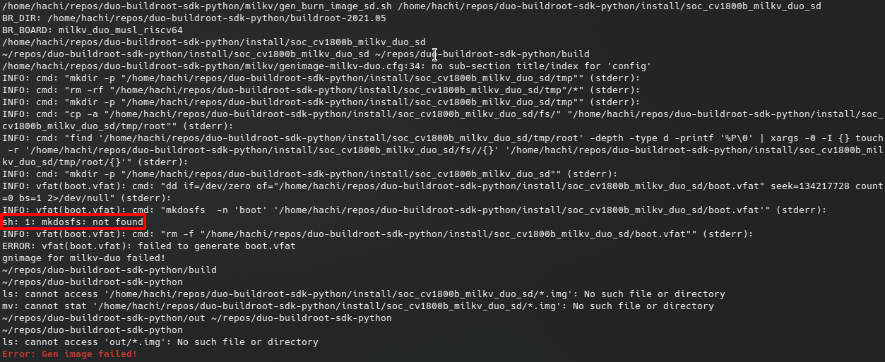

这是由于 ``mkdosfs`` 在 ``/usr/sbin`` 下，而默认的 ``PATH`` 中不存在此路径。注意重新运行 ``build_milkv.sh`` 将导致所有代码重新编译一遍，此时只需要将其加入 ``PATH`` 并手动运行镜像生成的函数即可

```bash
export PATH=/usr/sbin/:$PATH
pack_sd_image
```

此时可以构建成功，镜像文件为 ``install/soc_cv1800b_milkv_duo_sd/milkv-duo.img``

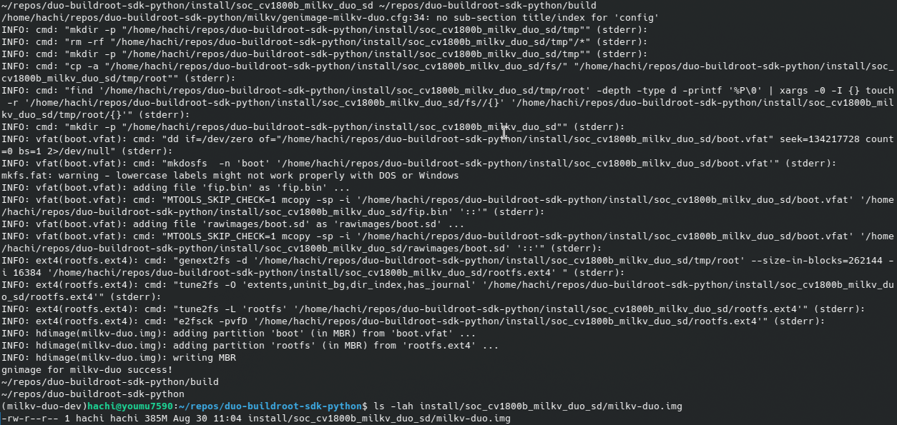

## 烧写镜像并启动 Milkv Duo

选取一张 Micro SD 卡，只要不是太小都没有问题，这里使用的是一张 8G 容量的卡；使用 ``fdisk -l`` 确认需要写入的设备路径，这里是 ``/dev/sdc``

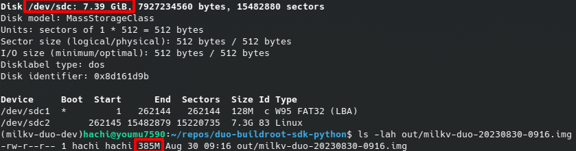

使用 ``dd`` 命令写入，注意千万不要搞错写入设备路径，写完以后记得 ``sync``

```bash
sudo dd if=out/milkv-duo-20230830-0916.img of=/dev/sdc bs=4M status=progress
```

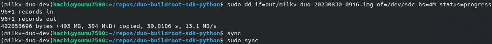

默认配置下根目录只有 256M ，这里使用了 gparted 扩展分区

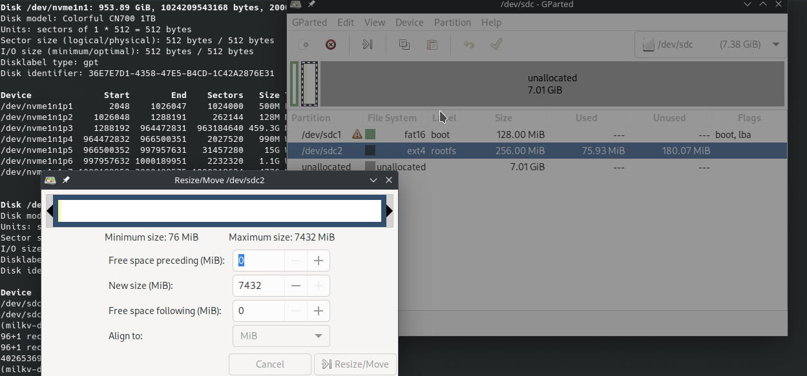

完成后将 Micro SD 卡插入 Milkv Duo 卡槽，通过 Type-C 口与上位机连接，上电几秒后蓝灯闪烁则镜像启动成功， sshd 则需要十几秒来启动

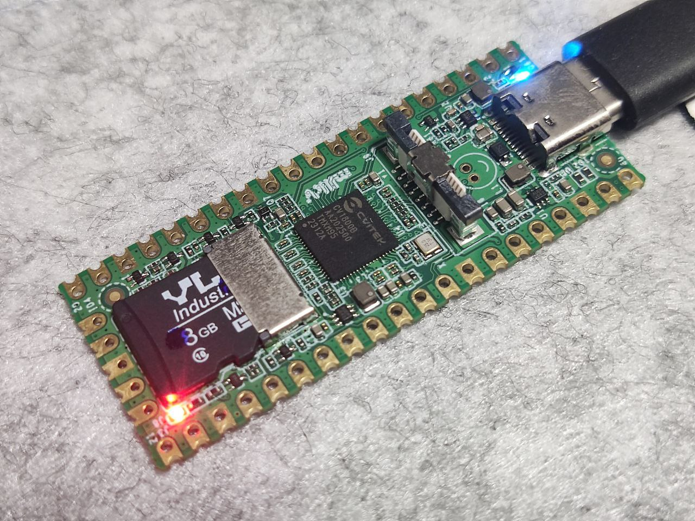

使用 ``lsusb`` 命令可以看到 RNDIS 设备，使用 ``ip addr`` 命令查看 IP 地址

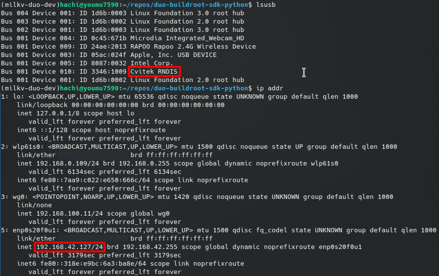

Milkv Duo 作为 DHCP 服务器为上位机动态分配了 192.168.42.127 这个 IP 地址，而 Milkv Duo 的 IP 地址为 192.168.42.1

使用 root 用户 ssh 登陆，密码为 ``milkv``

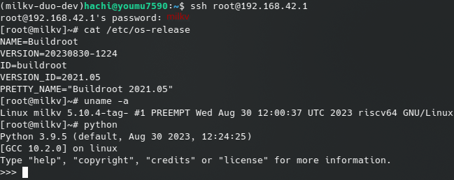

## 安装 pinpong 库

使用的 pinpong 库存放在 [pinpong.zip](./pinpong.zip)

使用 scp 命令将压缩包上传

注意如果使用的 OpenSSH 版本高于 9.0.0 ，则会出现 ``sh: /usr/libexec/sftp-server: not found`` 错误，需要添加 ``-O`` 选项

```bash
scp pinpong.zip root@192.168.42.1:~
```

在 Milkv Duo 上进行解压、安装和测试， ``site-packages`` 目录在不同 python 版本会有所不同，这里是 python3.9

```bash
unzip -q pinpong.zip
cp -r pinpong /usr/lib/python3.9/site-packages/
python -c 'import pinpong'
```


## 查看例程和板载资源

例程在 ``pinpong/examples/milkv-Duo/`` 目录下，板载资源可以在 ``pinpong/extension/milkvDuo.py`` 中看到

```bash
ls /usr/lib/python3.9/site-packages/pinpong/examples/milkv-Duo/
less /usr/lib/python3.9/site-packages/pinpong/extension/milkvDuo.py
```

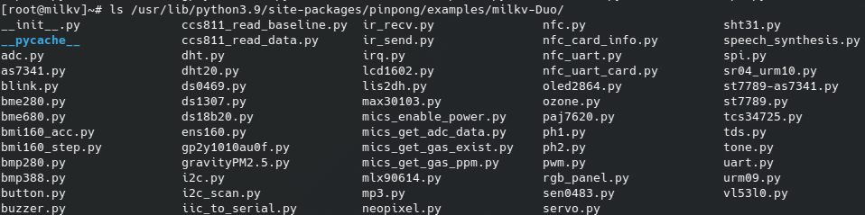

所有预置的例程，可以用于测试和开发参考

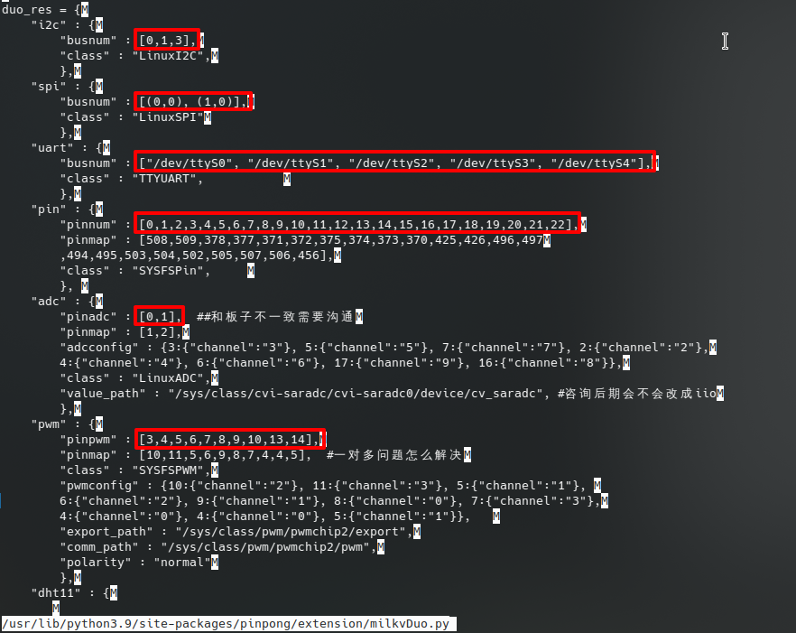

框选的部分表示支持的资源，支持 3 路 I2C 串口、 1 路 SPI 串口， 23 路 GPIO 引脚、 2 路 ADC 、 10 路 PWM 。
