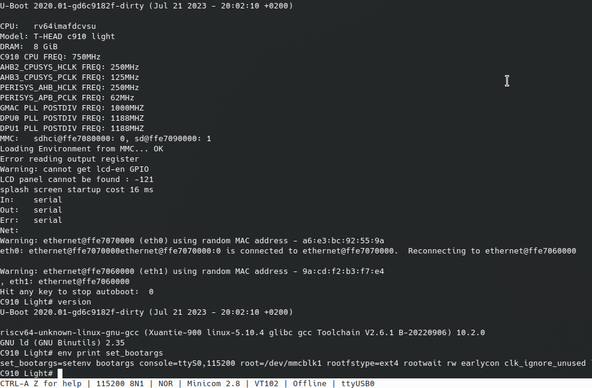
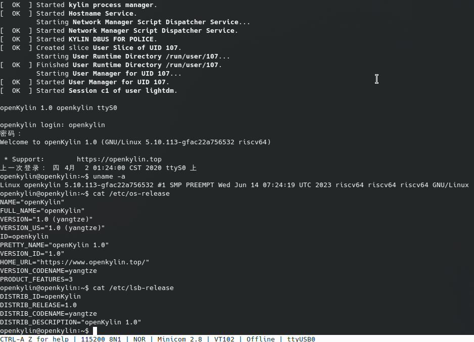
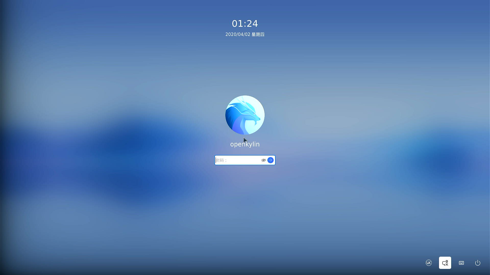
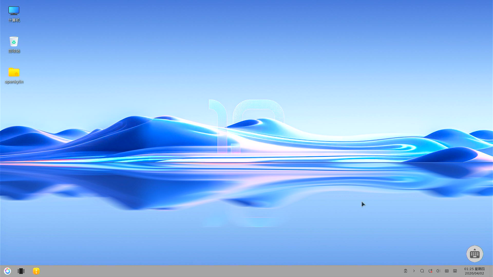

# openkylin Lichee pi 4A 测试报告

uboot U-Boot U-Boot 2020.01-gd6c9182f-dirty (Jul 21 2023 - 20:02:10 +0200)

## openkylin 安装

### 下载镜像

openkylin 镜像从其[下载首页](https://www.openkylin.top/downloads) 选择 LicheePi4A 下载，测试时得到的镜像为 openKylin-1.0-licheepi4a-riscv64.ext4.xz

由于下载的 openkylin 只有根目录镜像，故选择了从 RevyOS 启动，需要下载并向开发板 emmc 烧录 RevyOS 镜像。可以从 [mega 云盘](https://mega.nz/folder/phoQlBTZ#cZeQ3qZ__pDvP94PT3_bGA/folder/hp5BBCYS) 下载 LPI4A_20230721.zip 或从 [ISCAS 镜像](https://mirror.iscas.ac.cn/revyos/extra/images/lpi4a/20230614/) 下载原始分区镜像

### 烧写镜像

RevyOS 需要烧写进板载 emmc ，烧写过程参考 sipeed 官方文档[烧录镜像](https://wiki.sipeed.com/hardware/zh/lichee/th1520/lpi4a/4_burn_image.html)，这里不再赘述

openkylin 镜像烧写进 Micro SD 卡，这部分参考了 openkylin 官方文档 [riscv 上安装 openKylin](https://docs.openkylin.top/zh/%E7%A4%BE%E5%8C%BA%E5%BC%80%E5%8F%91%E6%8C%87%E5%8D%97/riscv%E4%B8%8A%E5%AE%89%E8%A3%85openKylin)

```bash
xz -d openKylin-1.0-licheepi4a-riscv64.ext4.xz
sudo dd if=./openKylin-1.0-licheepi4a-riscv64.ext4 of=/dev/sdX bs=4M status=progress
sudo resize2fs /dev/sdX
sudo sync
```

直接将需要替换的内核压缩包 kernel.tar.gz.zip 和 misc.tar.gz.zip 放置到 openkylin 镜像的 ``home/openkylin/`` 目录中

### 启动 openkylin

首先需要连接到串口终端编辑 uboot 启动参数，串口连接可以参考 sipeed 官方文档[系统串口](https://wiki.sipeed.com/hardware/zh/lichee/th1520/lpi4a/6_peripheral.html#%E7%B3%BB%E7%BB%9F%E4%B8%B2%E5%8F%A3)

开发板启动时，在 uboot 自动启动界面输入回车中断启动，编辑启动参数，保存后启动

```bash
env set -f set_bootargs 'setenv bootargs console=ttyS0,115200 root=/dev/mmcblk1 rootfstype=ext4 rootwait rw earlycon clk_ignore_unused loglevel=7 eth=ethaddr rootrwoptions=rw,noatime rootrwreset={factory_reset} init=/lib/systemd/systemd'
env save
boot
```



启动后登陆用户和密码均为 ``openkylin``

由于 openkylin 镜像适配的内核版本为 5.10.113-gbb4691fe5572 ，而 LPI4A_20230721 镜像内核版本为 5.10.113-gfac22a756532 ，所以需要复制 RevyOS 的内核模块

```bash
sudo mkdir /mnt/mmcblk
sudo mount /dev/mmcblk0p3 /mnt/mmcblk
sudo cp /mnt/mmcblk/lib/modules/5.10.113-gfac22a756532 /lib/modules
reboot
```



HDMI 输出也完全正常，鼠标和键盘成功驱动，之后的操作将不再依赖串口



可以成功登入桌面


