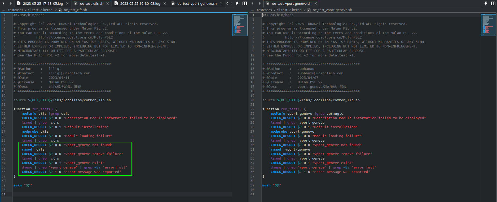

# x86 fail 用例汇总

## 写在前面

虽然某个测试在 oerv 和 x86 都 fail 了，但大部分原因都不同。

## 内核相关

有一个测试用例写法相关的共性问题，使用 ``find`` 查找文件结果不符合预期导致测试失败。

### kernel

1. 检查了 cpu rdrand 特性和 ARCH_RANDOM=y 内核编译选项 （前者 qemu 选项 -cpu qemu64,+rdrand ， 后者 x86 也没有）
2. 没有配置 CONFIG_BOOTPARAM_HUNG_TASK_PANIC_VALUE 内核编译选项（x86 同理）
3. 缺失内核模块 hinic.ko  和 cifs （x86 为 hinic.ko.xz 所以也 fail ， cifs x86 有）
4. 使用了未定义的 swap 空间 /dev/dm-1 和 /dev/openeuler/swap （x86 同理）
5. 测试套写错了（见图）



### kmod

oerv 缺失内核模块 dm_log dm_cache raid0.ko faulty.ko raid1 ； x86 内核模块齐全但是 raid0.ko.xz faulty.ko.xz 在脚本中写作 raid0.ko faulty.ko 而无法找到。

``oe_test_depmod`` 测试用 ``find`` 命令查找 System.map 和 Module.symvers 。在 oerv 上找到两个 System.map 导致拼接命令行出错； x86 则找不到这两个文件。

``oe_test_modinfo`` 测试在 x86 上， ``modinfo -p raid1`` 输出结果非预期。


## lvm2

1. 测试需要1～3块额外的块设备，但是 ``suite2cases/lvm2.json`` 中缺失 “add disk” 相关配置。
2. 两个测试没有引入测试对象软件包 lvm2 （都没有预装）
3. 两个测试依赖内核模块 dm-mirror （这个内核模块在 x86 不缺）
4. ``pvs`` 相关命令有问题 ``pvs | sed -n 3p | awk {'print$4'} | grep "30.00m"`` 改为 ``pvs | awk {'print$4'} | grep "30.00m"`` （貌似在 mugen-riscv 有纠正但是没并入上游）

在使用修复后的 ``lvm2.json`` 重新测试发现 x86 依然有大量用例不能测试通过， 原因在于 mugen 会将 ``/dev/sr0`` 误认为是可用的块设备返回给测试用例运行测试，导致测试出错。


## hostname

测试脚本没有引入 ``hostname`` 这个软件包，这个软件包在 oerv 预装了，在 x86 没有预装。

在 oerv 上 ``/etc/sysconfig/network`` 这个文件不存在导致了测试出错，``echo "NETWORKING=yes" > /etc/sysconfig/network`` 后可以测试通过。

在 x86 上安装了这个包以后测试可以通过。

## crontabs

没搞懂原因。 oerv 和 x86 出错原因一致。

```
# crontab -u root -l -s

Cannot obtain SELinux process context
```

在 VirtualBox 跑 oe 23.03 试了一下

```
# crontab -u root -l -s

no crontab for root
```

本来想在也本机跑一下的，但是较新的 crontab 没有 ``-s`` 这个选项了。

## dnf

dnf 比较复杂，原因暂时都被写为 “oerv 和 x86 的软件源结构不同（暂定）”

## iputils

oerv 和 x86 出现一样的问题，均为软件包问题。

待测软件包 iputils-ninfod 不存在，也没有别的软件包提供 ninfod.service 和 rdisc.service 。

## openssh

oerv 和 x86 出现一样的问题，均为测试用例问题。

1. ``oe_test_sec_ssh`` 没有引入测试依赖的软件包 firewall-cmd 及 semanage 非预期输出 ValueError: SELinux policy is not managed or store cannot be accessed.
2. ``oe_test_openssh_cipher`` ``grep "${NODE1_IPV4}" /tmp/log_128`` 输出不符合预期
3. ``oe_test_sec_jump_login`` openssh.json 缺少配置 "machine num": 2

```bash
# semanage port --delete -t ssh_port_t -p tcp 36

ValueError: SELinux policy is not managed or store cannot be accessed.
```

## net-tools

脚本中 ``NODE1_NIC`` 没有赋值就使用。

+ ``oe_test_net-tools_ipmaddr`` 赋 ``NODE1_NIC="eth0"`` 通过
+ ``oe_test_net-tools_route`` 赋 ``NODE1_NIC="eth0"`` 通过

## acl

oerv 和 x86 出现一样的问题，均为软件包问题。

没有引入测试对象软件包 ``systemd-pam`` 。

## osc

oerv 和 x86 是一样的问题，是用于测试的远程仓库异常

+ oe_test_osc_build
+ oe_test_osc_04

# TODO

## systemd

## openssl
