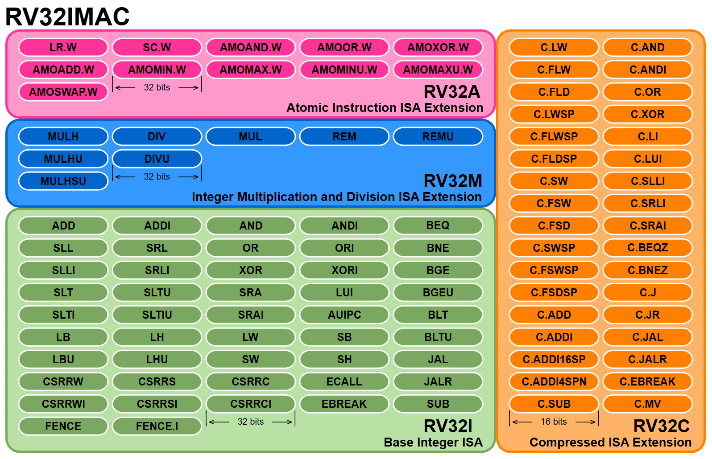
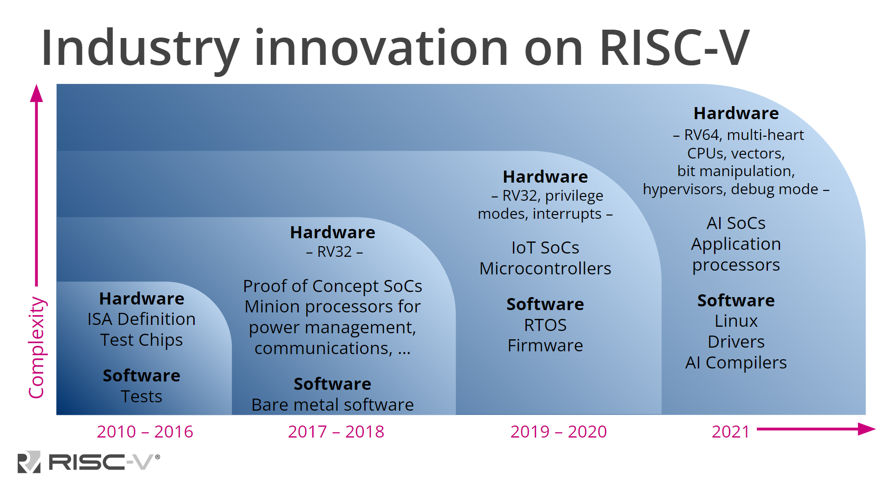
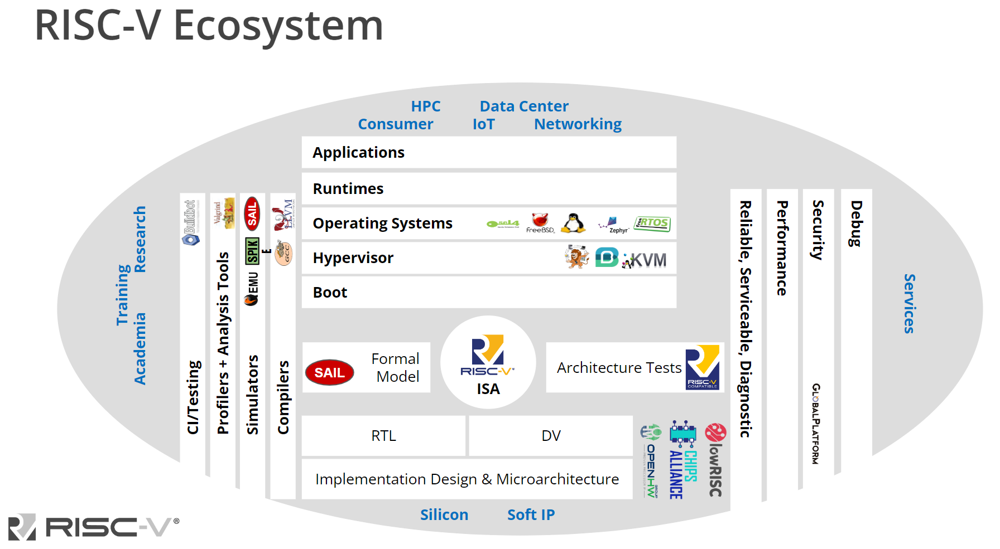

# RISC-V Overview

## Chapter Introduction

In this chapter, you will get acquainted with RISC-V. Please note that you are expected to already be familiar with computer architecture and to have some exposure to some specific ISA. We will provide some refreshers on basic terms, but this is certainly not an introduction to computer architecture.

Among the topics we will cover, you will learn about the history of RISC-V and how it differs from today’s dominating ISAs. You will also get the chance to browse through the vast documentation of RISC-V, and you will learn how the documents are organized.

You will be introduced to RISC-V International and the RISC-V ecosystem, and you will learn about quite a few different ways you may contribute to the RISC-V community.

Let us get started!

## Learning Objectives

By the end of this chapter, you should be able to:

+ Understand what RISC-V is and what it is not.
+ Identify the characteristics of an ISA to decide whether it is a CISC or a RISC type ISA.
+ Describe the history of RISC-V.
+ Identify the most notable differences between RISC-V and the leading commercial ISAs, like x86 and ARM.
+ Understand the structure and operation of RISC-V International.
+ Analyze the documentation of RISC-V specifications.
+ Explore ways to contribute to the RISC-V effort.

## History of RISC-V: The Free and Open ISA

RISC-V (pronounced “risk-five”) is an open standard instruction set architecture (ISA) based on the RISC principles, enabling a new era of processor innovation through open standard collaboration.

RISC stands for Reduced Instruction Set Computer, a computer architecture proposed in the early 1980s based on simplicity, as opposed to current microprocessors at the time, dubbed Complex Instruction Set Computers, or CISC. The RISC architecture was born in an academic environment, so the design strives for simplicity and efficiency, proposing a series of features that dramatically opposed the CISC philosophy, which was motivated by commercial interests at the time. RISC is the opposite of CISC in many ways: Usually, CISC CPUs have a few registers and lots of instructions, most of which have access to memory, whereas RISC CPUs have lots of registers and a very modest instruction set, with memory access restricted to a few Load and Store instructions.

RISC-V is the fifth generation of a research project that started around 1980. RISC-V is the result of an evolving project that began in 2010 at the University of California, Berkeley, based on experience with an abundance of previous projects, with Andrew Waterman, Yunsup Lee, Krste Asanović, and David Patterson as principal designers. An initial version of the RISC-V 32-bit instruction subset was used in the UC Berkeley Fall 2010 CS250 VLSI Systems Design class. RISC-V is a clean break from the earlier MIPS-inspired designs.

RISC-V was designed with the purpose of becoming a standard free and open architecture for industry implementations. RISC-V stands out because it is provided under open source licenses that do not require any royalty payments in order to use RISC-V in a system. Being consistent with the RISC principles, the RISC-V ISA is a load-store architecture.

The goal of the project was to create a new ISA that would be open and freely available for anyone to use, in contrast to proprietary ISAs like x86 and ARM, which are controlled by their respective companies.

The first version of the RISC-V ISA was released in 2011 and has since undergone several revisions and improvements. RISC-V has gained significant traction in the open-source community, and it is now supported by a wide range of hardware and software platforms, including microprocessors, FPGAs, and software tools.

RISC-V has been widely adopted in academia and industry, and it is being used in a variety of applications, including embedded systems, high-performance computing, and internet of things (IoT) devices. It is also being considered for use in future exascale supercomputers and other high-performance computing applications.

## Other Open Architectures

RISC-V is not the first open RISC ISA in existence, as the OpenRISC ISA can attest. In fact, the RISC-V development team, at some point, considered adopting the OpenRISC ISA. The team eventually decided against it because of the specific design decisions already taken therein (like having condition codes and the way immediate values are encoded), which deviate from the characteristics they were aiming for in a new architecture.

To learn more about openRISC, you may visit [OpenRISC - Wikipedia](https://en.wikipedia.org/wiki/OpenRISC) and [OpenRISC](http://openrisc.io/).

## The RISC-V Instruction Set Architecture

The RISC-V instruction set is modular, and it combines two types of ISAs: A base ISA and a set of ISA extensions. The base instruction sets implement a modest number of instructions for basic computations (like integer operations), whereas the ISA extensions implement instructions that may be required only for some applications (like multiplication, floating point, or atomic operations). This modular design allows for the creation of RISC-V processors for embedded systems, personal computers, and rack-mounted high-performance computers alike.

Every modular specification of RISC-V goes through a design process, where the maturity of the design is indicated by its status, which may be Open, Frozen, or Ratified. To learn about the lifecycle of a RISC-V Specification, you may read the [RISC-V Lifecycle Guide](https://docs.google.com/document/d/1Au3veNdNJQKPq-oiQRKTzdgmM72FDaqZOKeH7sOnG04/edit?usp=sharing).

As specified in the document titled “[The RISC-V Instruction Set Manual Volume I: Unprivileged ISA](https://riscv.org/wp-content/uploads/2019/06/riscv-spec.pdf)”, its original goals include:

+ A completely open ISA that is freely available to academia and industry.
+ A real ISA suitable for direct native hardware implementation, not only for simulation or binary translation.
+ An ISA that avoids “over-architecting” for a particular microarchitecture style (e.g., microcoded, in-order, decoupled, out-of-order) or implementation technology (e.g., full-custom, ASIC, FPGA), but which allows for an efficient implementation in any of these cases.
+ An ISA separated into a small base integer ISA, usable by itself as a base for customized accelerators or for educational purposes, and an extensive set of optional standard extensions to support general-purpose software development.
+ Both 32-bit and 64-bit address space variants for applications, operating system kernels, and hardware implementations.
+ An ISA with support for highly parallel multicore or manycore implementations, including heterogeneous multiprocessors.
+ Optional variable length instructions to both expand available instruction encoding space and to support an optional dense instruction encoding for improved performance, static code size, and energy efficiency.
+ A fully virtualizable ISA to ease hypervisor development.
+ An ISA that simplifies experiments with new privileged architecture designs.

## The RISC-V ISA Specification Documents

The RISC-V ISA is defined as avoiding implementation details as much as possible. It should be read as the software-visible interface to a wide variety of implementations rather than as the design of a particular hardware artifact. Nevertheless, multiple design decisions were influenced by hardware implementations in the spirit of simplifying the ISA, like separating the multiplication extension from the base integer ISA.

The RISC-V manual is structured in two volumes: The [first volume](https://github.com/riscv/riscv-isa-manual/releases/download/Ratified-IMAFDQC/riscv-spec-20191213.pdf) covers the design of the base unprivileged instructions, including optional unprivileged ISA extensions. Unprivileged instructions are those that are generally usable in all privilege modes in all privileged architectures, though behavior might vary depending on privilege mode and privilege architecture. The [second volume](https://github.com/riscv/riscv-isa-manual/releases/download/Priv-v1.12/riscv-privileged-20211203.pdf) provides the design of the first privileged architecture.

## An Example RISC-V Core

A popular RISC-V core for embedded applications is the RV32IMAC. Let us discuss what this nomenclature means.

Being the fifth generation of a research project that started in 1980, RISC-V is a seasoned architecture designed to succeed where others have failed in the past, learning from their mistakes. For this reason, RISC-V was designed as a modular ISA, as opposed to the traditional incremental ISAs in commercial processors like the ARM Cortex family. This modularity means that a RISC-V implementation is composed of a mandatory base ISA and a number of ISA extensions so that custom CPUs may be tailored to the needs of the application.

The naming convention for custom ISAs consists of the letters RV (for RISC-V) followed by the bit-width and an identifier for the variant.

With this in mind, RV32IMAC means:

+ **RV32I**: A 32-bit CPU with the Base Integer ISA. This includes the absolutely necessary instructions for basic operation.
+ **M**: The Integer Multiplication and Division extension.
+ **A**: The Atomic Instruction extension.
+ **C**: The Compressed Instruction extension. This extension is a clever addition to the RISC-V ISA because it provides an alternative 16-bit encoding for a special subset of existing instructions. In contrast, the regular instructions are encoded in 32 bits.

The unprivileged Base Integer ISA consists of only 40 instructions (the privileged ISA adds 24 instructions), and each extension adds some instructions. Here we have a graphical representation of the unprivileged RV32IMACZicsr_Zifencei Instruction set:

The image above describes the instruction set for the RV32IMACZicsr_Zifencei ISA, showing the modular (not incremental) nature of RISC-V. A mandatory Base ISA is combined with a set of extensions. The unprivileged version of the Base ISA is shown along with the 7 instructions in the Zicsr and Zifencei extensions as in the specification in 2017.

Compilers are informed of the extensions included in the target CPU so that they generate the best possible code. If the code has instructions from extensions that are missing in the physical CPU, it triggers an illegal instruction exception. The software running on the CPU will have to handle this exception and take appropriate action, such as emulating the instruction or providing an alternative implementation.

So, next time you see assembly code in a disassembly view, try to notice that it contains RISC-V assembly instructions that may or may not be listed in this diagram. You may even want to check the execution of these instructions to get a better appreciation of what is going on.

To learn more about the RISC-V ISA, consider reading the book titled [*The RISC-V Reader*](http://riscvbook.com/) by David Patterson and Andrew Waterman. The English version is very inexpensive, and the Spanish, Portuguese, Chinese, and Korean translations are [free to download](http://riscvbook.com/).

## How RISC-V Differs from ARM and x86

The ARM and x86 architectures are two of the most widely used in the world today. These proprietary architectures, owned by ARM and Intel, respectively, are most likely present in your household in a variety of devices. These range from your computers, tablets, smartphones, and video game systems all the way down to embedded devices like your TV, wireless router, or printer. This also applies to devices where most people would be surprised to learn that there is a microprocessor inside, like a washer, dryer, refrigerator, TV remote, or a talking toy.

Of these two commercial architectures, x86 is the one that differs the most from RISC-V. That is because x86 is a CISC processor, which is the complete opposite philosophy of RISC. So, x86 processors have lots of instructions and lots of addressing modes. Most instructions have access to memory, and instruction encoding varies in size. It has just a few general-purpose CPU registers, and so on. In contrast, RISC-V has the opposite traits: Fewer instructions, very few addressing modes, most instructions operate on registers (with memory access restricted to Lad and Store instructions), instruction encoding is uniform, and it has lots of general-purpose CPU registers.

Thus, there is a core philosophical difference between RISC-V and x86, and that is the CISC vs. RISC debate.

When it comes to ARM, the difference with RISC-V is a bit more subtle and specific, as the R in ARM stands for RISC. Throughout its history, ARM has produced several models and versions of their ISAs, all of which are the evolution of the RISC movement of the 1980s. Just like its RISC competitors (SPARC, MIPS, PowerPC, etc.), ARM adopted most of the design decisions proposed in the original RISC papers. Still, they also gave in to certain industry and commercial demands not unlike the ones that led to the messy CISC design in the 1970s.

So today, the ARM architecture has deviated from the original RISC guidelines, which in turn makes it different from the RISC-V ISA. For example:

+ The ARM Thumb-2 architecture has 16 registers, whereas RISC-V has 32.
+ The ARM Thumb-2 architecture is incremental, whereas RISC-V is modular.
+ The ARM Thumb-2 instruction set contains certain CISC-like complex instructions.

In contrast to both x86 and ARM ISAs, RISC-V was born in an academic environment without any commercial interests. Instead, the main goal of RISC-V is the original goal of RISC: Efficiency through simplicity.

## The Future of RISC-V

Since its inception in 2010, RISC-V has been attracting considerable attention from countless companies, universities, vendors, and programmers. This attention has led to a large number of commercial and noncommercial implementations of RISC-V processors, which has helped RISC-V grow from a theoretical specification to a reality.

Many experts have speculated about the future of RISC-V, especially pondering the possibility of RISC-V taking over the market currently dominated by ARM and Intel. If you search this topic online, you may find conflicting opinions, so before jumping to conclusions, perhaps it is best to look at the past and observe how RISC-V has been gaining ground and revolutionizing the semiconductor industry.

Although it is possible that RISC-V will end up failing to compete significantly with its well-established competitors, the data available today shows otherwise. At the very least, RISC-V is a promising architecture for select commercial and research purposes, as shown in the following chart below.

Since its inception in 2010, RISC-V has been well-received by the microprocessor industry, and adoption has been steadily growing both in hardware and software.

To form your own opinion about the future of RISC-V, you may want to review the following articles:

+ [The Past, Present and Future of RISC-V](https://www.youtube.com/watch?v=RrVRMFjYti0) by Krste Asanović.
+ [Is RISC-V the Future?](https://semiengineering.com/is-risc-v-the-future/) by Roddy Urquhart.
+ [Why RISC-V Architecture Is the Future of Embedded Design](https://www.designnews.com/embedded-systems/why-risc-v-architecture-future-embedded-design) by Chris Jones.
+ [Top Three Reasons to Adopt RISC-V](https://www.computer.org/publications/tech-news/trends/reasons-to-adopt-risc-v) by Desi Banatao.

## RISC-V International

RISC-V International is a global nonprofit organization that owns and maintains the RISC-V ISA intellectual property. One of its main goals is to keep the design of RISC-V based on simplicity and performance, as opposed to focusing on commercial interests. For this reason, RISC-V International relies on its members, who represent the microprocessor ecosystem population, ranging from individuals to large organizations like Google, Intel, and Nvidia. Becoming a member has a host of benefits, including the possibility of contributing in the design of the ISA and voting to approve proposed changes.

As stated by RISC-V International, more than 3,100 RISC-V members across 70 countries contribute and collaborate to define RISC-V open specifications as well as convene and govern related technical, industry, domain, and special interest groups.

As a nonprofit, RISC-V does not maintain any commercial interest in products or services. As an open standard, anyone may leverage RISC-V as a building block in their open or proprietary solutions and services. RISC-V does not take a political position on behalf of any geography. RISC-V was founded in 2015 as the RISC-V Foundation and is incorporated today as RISC-V International Association in Switzerland.

At the base level, the RISC-V ISA and extensions ratified by RISC-V International are royalty-free and open base building blocks for anyone to build their own solutions and services on. The RISC-V ISA and ratified extensions are provided under globally accepted open licenses that are permanently open and remain available for all.

Beyond RISC-V International, the community has the opportunity to provide their own free or proprietary IP, implementations, solutions, and services for which RISC-V has no commercial or governance interest.

RISC-V International is wholly committed to design freedom, choice, and flexibility and supports open architecture extensions to the RISC-V ISA, but it does not support work on alternative versions of the RISC-V ISA.

To learn more about RISC-V International and its role in the RISC-V ecosystem, visit the [RISC-V International website](https://riscv.org/).

### RISC-V International Governance

RISC-V International is governed by its Board of Directors. The Board is composed of Directors elected to represent all classes of membership to ensure the offering of a strategic voice at all levels. In addition, the Technical Steering Committee (TSC) provides leadership to the organization’s technical initiatives in setting long-term strategy, forming tactical committees and work groups, and approving technical deliverables for ratification or release. RISC-V International also supports and drives ad hoc and standing groups to pursue specific industry, geographic, and strategic interests through a variety of constructs. The aim of RISC-V International is to guide and facilitate the broadest and most effective collaboration for the benefit of their member community.

## RISC-V Documentation

If you plan to get involved with RISC-V at any level, it is important to know how to find pertinent documentation. For that purpose, let us dive into what goes where in the official RISC-V documentation.

In short, you may find all the official documentation in the [RISC-V Technical Specifications Wiki](https://wiki.riscv.org/display/HOME/RISC-V+Technical+Specifications). The whole documentation is contained in a handful of documents. At the time this course was created, these are the official specification documents:

**ISA Specifications (Base ISA and ISA extensions):**

+ [The RISC-V Instruction Set Manual, Volume I: Unprivileged ISA](https://github.com/riscv/riscv-isa-manual/releases/download/Ratified-IMAFDQC/riscv-spec-20191213.pdf) is the main specification document where the Base ISA and ISA extensions are defined.
+ [The RISC-V Instruction Set Manual, Volume II: Privileged Architecture](https://github.com/riscv/riscv-isa-manual/releases/download/Priv-v1.12/riscv-privileged-20211203.pdf) is a document that covers elements pertinent to advanced systems where a privilege distinction is needed. Some examples of these elements are interrupts, exceptions, virtual memory management, and physical memory protection.
+ [A list of recently ratified extensions](https://wiki.riscv.org/display/HOME/Recently+Ratified+Extensions) is maintained separately.

**Non-ISA Specifications (Everything else):**

+ [Efficient Trace for RISC-V](https://github.com/riscv-non-isa/riscv-trace-spec/releases/download/v2.0rc2/riscv-trace-spec.pdf) specifies the signals between the RISC-V core and the encoder, compressed branch trace algorithm, and the packet format used to encapsulate the compressed branch trace information to implement processor tracing.
+ [RISC-V ABIs Specification](https://github.com/riscv-non-isa/riscv-elf-psabi-doc/releases/download/v1.0/riscv-abi.pdf) provides the processor-specific application binary interface for RISC-V processors.
+ [RISC-V External Debug Support](https://github.com/riscv/riscv-debug-spec/raw/release/riscv-debug-release.pdf) outlines a standard architecture for external debug support on RISC-V platforms.
+ [RISC-V Supervisor Binary Interface Specification](https://github.com/riscv-non-isa/riscv-sbi-doc/releases/download/v1.0.0/riscv-sbi.pdf) describes the RISC-V Supervisor Binary Interface (SBI), which enables supervisor-mode (S-mode or VS-mode) software to be portable across all RISC-V implementations by defining an abstraction for platform (or hypervisor) specific functionality.
+ [RISC-V UEFI Protocol Specification](https://github.com/riscv-non-isa/riscv-uefi/releases/download/1.0.0/RISCV_UEFI_PROTOCOL-spec.pdf) details all-new UEFI protocols required only for RISC-V platforms.

For the latest RISC-V documentation, visit the [RISC-V Technical Wiki](https://wiki.riscv.org/display/HOME/RISC-V+Technical+Specifications).

## Contribute to RISC-V

There are as many ways to contribute to RISC-V as there are components in an instruction set architecture’s ecosystem.

Here are some ways you may contribute to the RISC-V community:

+ Build RISC-V knowledge through the ***Learn*** resources.
+ Become a ***RISC-V Ambassador*** technical expert.
+ Post RISC-V technical position openings on ***RISC-V Careers***.
+ Become a mentor and guide a ***RISC-V Mentorship*** project.
+ Help maintain the technical specifications.
+ Write and share your own RISC-V projects.

For a detailed list of ways you may contribute, be sure to read the [RISC-V Member Benefits and Welcome](https://docs.google.com/presentation/d/1Q8gMcVwzqdqym3ugl_Q-LW0KMUApO-v8mWVdjqQE-MI/edit?usp=sharing) presentation.

The image below shows some of the numerous areas of application where you may contribute.

### Technical Contributions

+ To learn about the process of contributing to RISC-V on a technical level, please read the [Developer Getting Started Guide](https://docs.google.com/document/d/1Qjf6BwMmtqTfzftr3WWf2bRv8Cl4f0qZrWWbr0jCBSU/edit#heading=h.xxadm6tcndk9) in the [RISC-V Technical Wiki](https://wiki.riscv.org/display/HOME/Home).
+ To contribute to a specification or a technical area, you may look for the [most relevant group in Groups.IO](https://lists.riscv.org/g/main), join it, follow the discussions on the mailing list, attend the meetings, and volunteer to help.
+ To propose a new group, specification, or topic, send an email to [help@riscv.org](mailto:help@riscv.org) for guidance on where to start.

### Proposing New Instructions

RISC-V was designed to allow anyone to add new instructions to the base ISA and any of its extensions. You can do this freely on your own implementations, but you may also contribute to the official ISA specifications. For the latter, you must become an active member of the RISC-V community in charge of maintaining the documents you intend to contribute to. These communities are specified in the [RISC-V Technical Wiki](https://wiki.riscv.org/display/HOME/Home).

### Identifying and Resolving Issues in GitHub

The RISC-V instruction set architecture (ISA) and related specifications are developed, ratified, and maintained by RISC-V International contributing members within the RISC-V International [Technical Working Groups](https://live-risc-v.pantheonsite.io/technical/technical-forums/). Work on the specification is [performed on GitHub](https://github.com/riscv/riscv-isa-manual), and the [GitHub issue mechanism](https://github.com/riscv/riscv-isa-manual/issues) can be used to provide input into the specification.

## Chapter Summary

Congratulations on making it through this chapter!

Let us take a moment to look back and summarize some of the knowledge you have acquired:

+ You became familiar with RISC-V and its evolution.
+ You learned about RISC-V International, the owner and maintainer of RISC-V.
+ You learned how RISC-V differs from the dominating ISAs like x86 and ARM.
+ You became acquainted with the documentation of RISC-V specifications.
+ You learned how to contribute to RISC-V International in any of its various areas.

Feel free to come back to this material if you need a brushup in the future.
