# mugen 自动化测试工具的缺陷和改进

## 我们为什么要使用 mugen

官方的介绍

mugen 是 openEuler 社区开放的测试框架，提供公共配置和方法以便社区开发者进行测试代码的编写和执行

当前的角色

mugen 具有一系列开源的测试套和测试用例，大部分测试套对一个软件包或一种功能进行测试，也有专门的测试套是对测试环境的整体功能进行全面测试。 mugen 是 openEuler 上游比较重视的测试之一，其测试结果是软件包质量的一个体现。

## 用最简单的方式使用 mugen

openEuler RISC-V 2309 一共进行的 Round1-Round4 四次针对 bashOS 的 mugen 测试中， Round1 一共测试了 273 个测试套， 2120 个测试用例。

由于测试套数量众多，最简单的方法就是跑一个循环

```bash
for t in $(cat mylist); do
    bash mugen.sh -f $t -x
done
```

这样运行 mugen 测试没有考虑两个问题：

+ 一些 mugen 测试会对测试环境的软件包、网络配置、 systemd daemon 进行一系列操作，且不见得能还原
+ 不同 mugen 测试要求的磁盘数量、测试机数量、网卡数量并不相同

尽管可以简单搭建一个最大化的环境，但使用上面的脚本无法实现测试套之间测试环境的统一，而实际上它也是无法完成所有测试的

## 测试环境

四台具有两个以太网卡和四块空闲硬盘的计算机可以满足大部分 mugen 测试用例的测试要求，但是这样的测试环境并不是每个人都可以获得的

且实际上进行的 mugen 测试是 RISC-V 和 x86 双架构的对比测试，为了方便测试的自动化进行和两种架构测试环境的相对统一，我们使用 Qemu 虚拟机来完成所有测试

## 测试流程

一次完整和独立的测试

1. 自动化测试得到 RISC-V 和 x86 的日志

整体逻辑 qemu_test.py -> mugen_riscv.py -> mugen.sh

主要受计算机性能、自动化测试工具可靠性以及 mugen 自身质量的影响

2. 自动化日志分析得到测试结果列表

result_parser.py 对日志进行基于字符串匹配的自动分析，输出失败用例列表并给出可能的失败原因

若测试状态和上一次测试相同则复制上一次测试得到的失败原因

3. 人工重测和分析仅 RISC-V 失败的用例

通常需要一天到两天

4. 人工对比、重测和分析在 RISC-V 和 x86 均失败的用例

检查两个架构失败原因是否相同，防止遗漏 RISC-V 独有的缺陷

最耗时的步骤，通常需要几天来完成

对于 mugen 自动化测试工具的改进只涉及第一步效率的提升

## qemu_test.py

qemu_test.py 是第三测试小队一直在使用的多线程 Qemu 自动化测试脚本。该脚本读取测试套的配置 json 文件自动建立测试用虚拟机实例、磁盘和网卡，利用 ``qemu-img`` 的 backing file 功能实现测试环境的自动复原，且同时支持 Linux 和 MacOS 操作系统

+ 额外的网卡 ``-netdev tap,id=nettap0,ifname=tap0,script=no,downscript=no -device virtio-net-pci,netdev=nettap0,mac=52:54:00:11:45:00``
+ 额外的磁盘 ``-drive file=disk0-0.qcow2,format=qcow2,id=hd0-0,if=none -device virtio-blk-pci,drive=hd0-0``

## 2303 版本测试遇到的问题

### 不支持多架构虚拟机

原有的 qemu_test.py 只支持 RISC-V 架构，在 2303 测试中经常可以遇到 RISC-V 和 x86 测试环境不一致的情况，这可能会导致遗漏一些 RISC-V 独有的问题，也极大增加了手动重测的工作量。

解决这种问题最好的方式就是在 qemu_test.py 中集成两种架构虚拟机的支持。

在原有的脚本中，所有参数均是以硬编码的方式呈现，在添加 x86 虚拟机架构支持的同时也将一些必要的但是没有引出的例如 qemu 的 -append 参数通过脚本命令行参数或配置文件的方式引出，使其可配置。

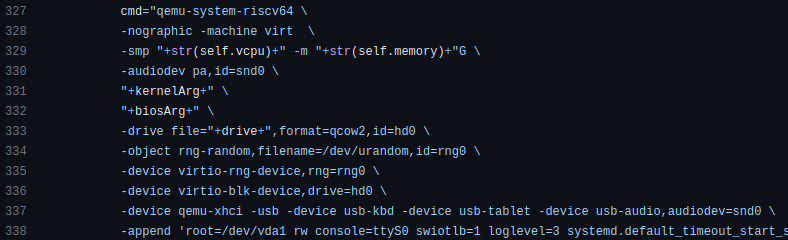

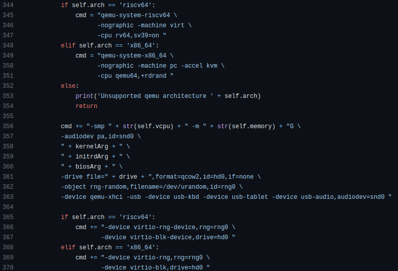

而在没有指定的情况下依然运行 RISC-V 架构的虚拟机，和采用默认参数来做到对旧配置文件的兼容。

https://github.com/brsf11/mugen-riscv/pull/15

### 文档不完善

在初期做实习生时，在遇到问题的时候需要从每个已知的仓库寻找现有的文档并结合代码揣测脚本的预期状态，不容易独立搞清遇到的问题是脚本 bug 还是使用不当

所以在 2303 测试的后期对最重要的 qemu_test.py 和 mugen_riscv.py 两个脚本文档进行了修订

https://github.com/brsf11/mugen-riscv/pull/18

## 2309 版本初期遇到的问题

### x86 2309 不再支持 bios 启动

在 openEuler 上游释出的 x86 qemu 镜像需要以 UEFI 模式启动，故需要在 qemu_test.py 中添加 UEFI 启动的支持，对应操作的就是给 qemu 传入一个 pflash 设备

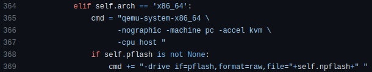

又由于这个 pflash 映像不可重入，所以对每个虚拟机实例都建立独立的映像

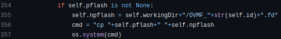

### 自动化测试退化为手动测试

在 2309 的测试中，我们的 qemu_test.py 自动化测试脚本经常出现所有测试进程假死的情形，一部分是因为进程真的死了，另一部分是因为大量操作无法正常完成等待超时杀死，导致自动化测试过程越来越倾向于需要逐个手动干预。同时测试完成后发现的误报带来大量的手动重测工作量。

<!--在 Round1 中报告的 184 个只在 RISC-V 失败的用例中， 40 个为 mugen 问题（预装列表问题和用例本身问题）， 65 个手动测试可以直接通过，另有 x86 日志缺失导致误认是为 RISC-V 独有问题的情况。-->

而造成这些问题的原因多种多样

#### 1. 主测试机失联

主测试机失联具有两种情形

1. 测试套编写不合理导致主测试机失联

一些测试用例会重启 sshd 或调用防火墙阻止 22 端口流量，而自动化测试脚本依赖 ssh 来对测试机进行控制。若测试套在测试完成后没有对这些环境进行还原，将导致测试日志无法导出，测试机而无法关闭，测试进程假死

然后就会遇到类似这样的情形

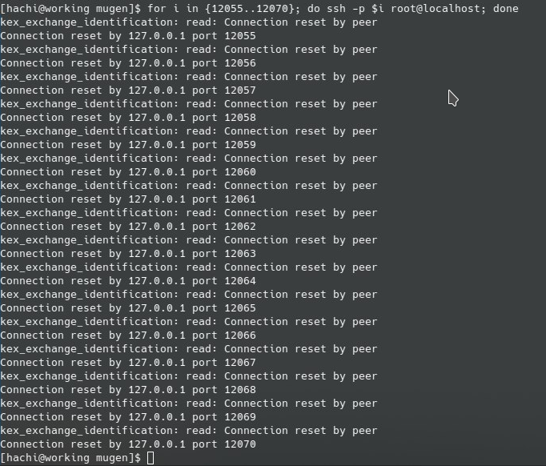

也有比如在测试 systemd 时，不仅 ssh 挂了，终端也进 rescue mode 了。但实际上虚拟机本身运行是正常的，如果提前 ssh 进去是可以拿到测试日志的

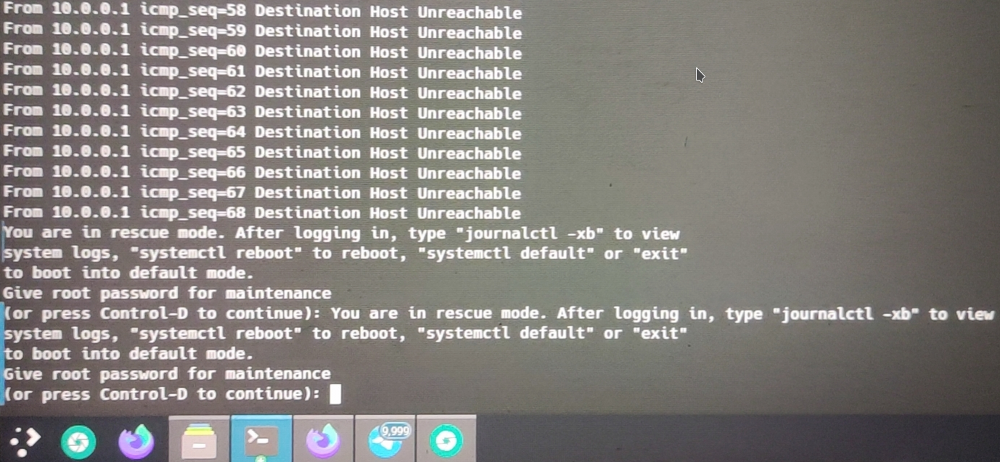

这种情况最好的解决方法还是向 mugen 上游提交修复

2. 疑似 python subprocess 问题导致虚拟机没有正常启动

当时 qemu 进程启动后无法 ssh 上， htop 观察发现进程占用内存较少没有波动

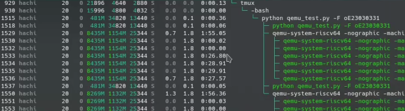

最后认为和 python subprocess 相关是因为尝试向 qemu_test.py 发送 SIGTERM ，之后 Qemu 进程直接挂在了 init 下。此时占用的内存开始增加，虚拟机也能够经由 ssh 连上

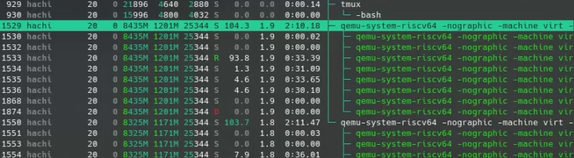

具体原因依然不清楚

#### 2. 二号机失联

由于一些测试用例需要多台虚拟机配合测试，所以这里将主测试机以外的测试机失联的情况统称为二号机失联

二号机失联的情况起初一直被当作测试环境问题对待，实际上测试环境自动搭建的过程没有任何问题，而是在测试过程中二号机下线了

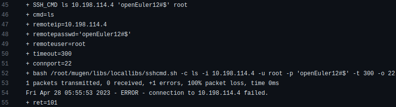

一般也都是发生在测试用例对二号机进行重启操作时，二号机没有正常重启，该测试用例将一直等待二号机上线直到测试超时，并直接导致后面多机测试的用例全部失败。这也是怀疑与 python subprocess 相关

对于 python subprocess 相关的问题，我的解决方法是用 screen 工具作为管理 Qemu 进程的替代。同样也是添加一个可选的参数和配置文件选项，只在指定的时候启用 screen ，对旧的配置并不改变行为

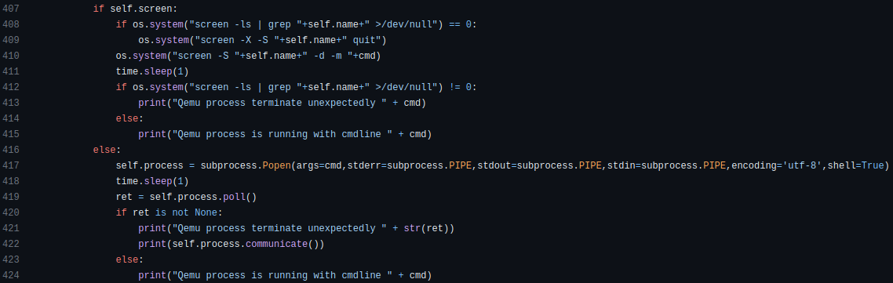

使用 screen 的额外好处是必要时可以定向串口控制台，便于在测试过程中发现和排查问题

#### 3. 二号机重启后无法 ping 通外网

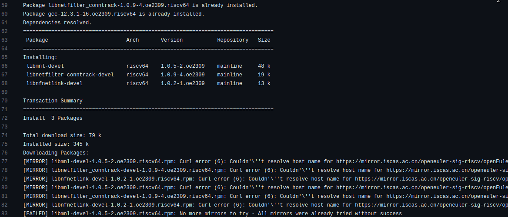

起初认为是网络波动导致的软件包安装失败，但是在之后手动测试中发现能够稳定复现

在多机测试的环境下，每个 qemu 实例至少有两个虚拟网卡设备，其中一个用于连接外网和与宿主机通信，另一个用于透过宿主机上的网桥实现 qemu 实例之间的通信

最后检查发现 qemu_test.py 在配置完网络后， ``ip route`` 命令显示了相对应的两条路由，而通往网桥的路由优先级更高

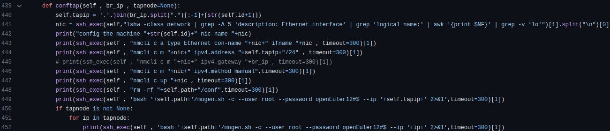

修复方法是在配置连接网桥的网卡时不配置 gateway ，也就不会出现相应的路由路径

https://github.com/brsf11/mugen-riscv/pull/21

## 2309 版本测试现状

在 Round4 和 Round5 测试中，最大的一个改善就是启用 screen 来管理 Qemu 进程后，暂时还没有再发现测试进程假死的情况。

跑 baseOS 测试范围共 273 个测试套的列表，可以一次跑完不会卡住。只有 firewalld 、 systemd 由于测试用例有问题需要额外手动干预。

理想状态下，在 R9 5900X 机器上历时 12 小时就可以完成一轮测试，得到所有测试日志。

## 展望

1. 降低测试用例之间的干扰（WIP）

同一个测试套内的测试用例逻辑上是相互独立的，但实际测试中却会互相干扰。可以将大型的测试套转换为多个小测试套，并行测试的同时又减少了用例间的干扰

2. 重测自动化（WIP）

能够重测通过的用例在所有失败用例中的占比较高，自动重测将减少手动重测的工作量，提升测试效率
